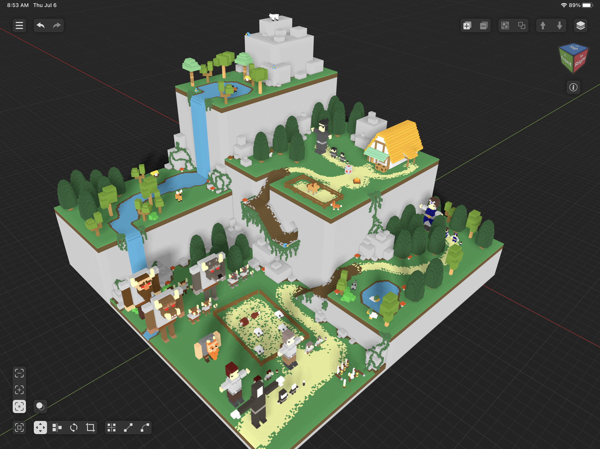
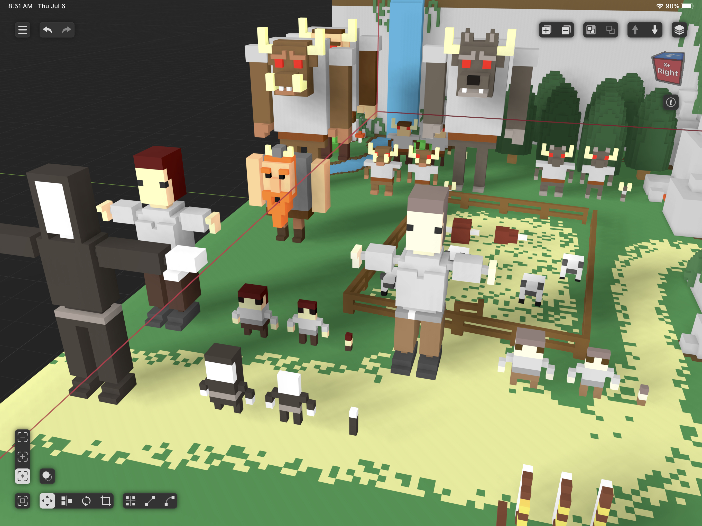
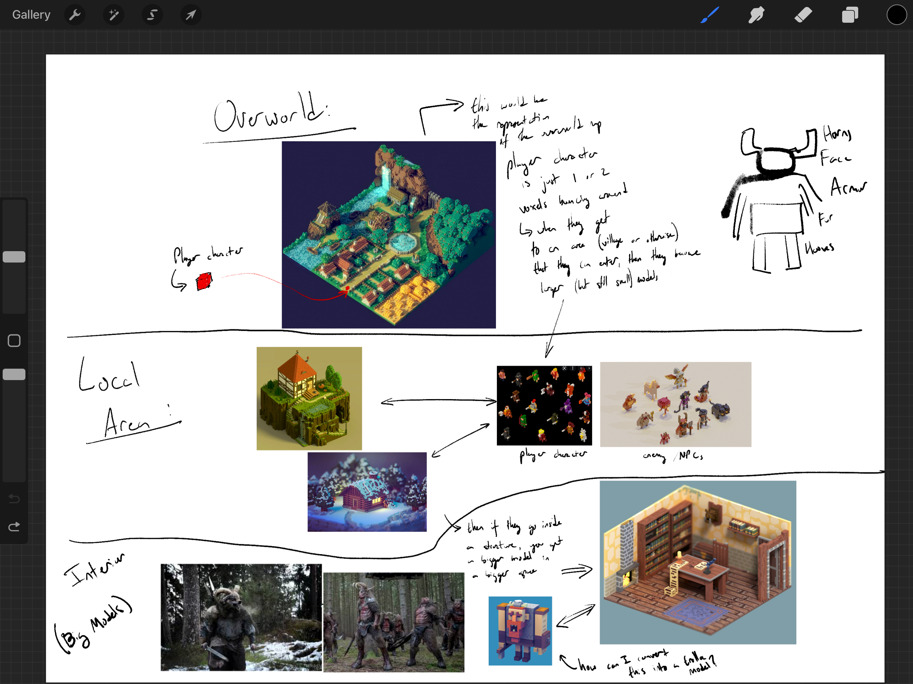

# wot_a_good_game
WOT: A Good Game - Wotxels; the first of its name


- Youtube: https://www.youtube.com/@wellknowngamestudio9054
- Twitter: https://twitter.com/WellKnownGames

https://github.com/user-attachments/assets/8b2264e0-786f-4255-acdd-2ce72fbf0ed4


## Overview

Here is an overview picture of the models that have been made for the prototype
so far and how (in the modeling software) they were built together to get a
rough idea of how well they look together and work together.



Here is a zoomed-in view of the character sizes, starting with the largest on
the left, with two options for medium models (medium and medium-flat), and then
the smallest model (which is simply a few small blocks of certain colors/traits).



Here is an example drawing showing the different level sizes (rough
approximation) that could be used for different parts of the world, broken down
into 3 main categories:

1. Overworld - This is the most zoomed out, at which point we'd be using the
   smallest character models, that would only be a few blocks tall. The
   Overworld allows the player to traverse the whole world and enter points of
   interest. Within the overworld the player can see the points of interest
   rendered as smaller models, and can even see other smaller versions of NPCs
   such as enemies and friendlies (but likely not animals and other
   environmental objects).
2. Point of Interest - This is the medium model - at which point we'd be using
   the medium / medium-flat models. This would be used for towns or other places
   that the character goes to in the overworld. Within points of interest there
   will be NPCs including animals, as well as interactibles such as buildings,
   chests, collectables, and such. If a player enters a building / cave, etc.
   they will transition to the interior model (largest).
3. Interior - This is the most zoomed in model of a specific place which uses
   the largest / most detailed character model. This might be used for the
   inside of a house or cave for instance.



Here is how they currently look:

Interior (Rand House):


https://github.com/user-attachments/assets/182c351e-db70-4b15-8f6e-cedbf3868c5a

Overworld:


### Controls:


### Opening

https://github.com/Well-known-Game-Studio/wot_a_good_game/assets/213467/07de2f99-19bc-4531-b0dd-976531cbe2f2

### Herding

https://github.com/Well-known-Game-Studio/wot_a_good_game/assets/213467/e68240f3-9376-4ee2-af0b-171f75ccd8f2

### Attack

https://github.com/Well-known-Game-Studio/wot_a_good_game/assets/213467/b3bde112-3e55-42ee-baf5-fece5317146d

## Development

If on MacOS: [using modern xcode](https://dev.epicgames.com/documentation/en-us/unreal-engine/using-modern-xcode-in-unreal-engine)

### Programming

Here's a useful [Unreal Engine Style
Guide](https://github.com/Allar/ue5-style-guide) that can help answer some
questions about why and how to do certain things within UE5.

#### Packaging

#### Setup for iOS App

TODO: add info.

#### Setup for MacOS App

If you want to do direct distribution for MacOS, you need to enable `Hardened
Runtime` in the Xcode project. It's also recommended to do `Product->Archive`
from within XCode to ensure everything is signed properly.

[Post about dSYM files](https://jasont.co/debug-unreal-on-mac/)

#### Setup for Android App

Follow the setup instructions
[here](https://docs.unrealengine.com/5.6/en-US/how-to-set-up-android-sdk-and-ndk-for-your-unreal-engine-development-environment/).

Note: you will likely have to modify the `/Users/Shared/Epic\
Games/UE_5.6/Engine/Extras/Android/SetupAndroid.command` file - possibly to
point to the right `JAVA_HOME` directory. In my case I had to modify the
JAVA_HOME export in the `SetupAndroid.command` file to point to
`/Library/Java/JavaVirtualMachines/jdk-17.jdk/Contents/Home` and had
to install jdk8 specifically.

You will need to set the environment variables (under `Android SDK`)
appropriately, e.g.:

- `Android SDK` : `/Users/bob/Library/Android/sdk`
- `Android NDK` : `/Users/bob/Library/Android/sdk/ndk/28.1.13356709`
- `Location of JAVA` : `/Library/Java/JavaVirtualMachines/jdk-17.jdk/Contents/Home`
- `SDK API Level` : `android-34`
- `NDK API Level` : `android-34`

For that version of java (jdk 8) which is required to successfully build for
android, you can (on macos) install it via:

``` sh
brew install --cask adoptopenjdk8
```

You will also need to update a build config file in your unreal engine
installation. See [this
link](https://forums.unrealengine.com/t/google-play-aidl-submission-error-ue-5-4/1810571/3)
for more info.

Add the following lines to the `dependencies` section of your UE `app/build.gradle`:

`/Users/Shared/Epic Games/UE_5.6/Engine/Build/Android/Java/gradle/app/build.gradle`

```gradle
dependencies {
	implementation fileTree(dir: 'libs', include: ['*.jar'])
	implementation fileTree(dir: 'src/main/libs', include: ['*.jar'])

	// note Gradle will use newest version if multiple specified
	implementation('androidx.appcompat:appcompat:1.2.0')
    implementation 'androidx.lifecycle:lifecycle-extensions:2.2.0'
	annotationProcessor 'androidx.lifecycle:lifecycle-compiler:2.6.1'

    // ADD THE LINES BELOW:
    def billing_version = "6.1.0"
    implementation "com.android.billingclient:billing:$billing_version"
}
```

To sign your app, you need to follow these instructions
[here](https://dev.epicgames.com/documentation/en-us/unreal-engine/signing-android-projects-for-release-on-the-google-play-store-with-unreal-engine)

For more information about packaging for android see [this
link](https://dev.epicgames.com/documentation/en-us/unreal-engine/packaging-android-projects-in-unreal-engine).

### Modeling Workflow

All modeling is done with `VoxelMax`, make sure in the settings to select
`Optimize Mesh` and to configure the `Minimum Texture Size` to at least
1024x1024.

If you have exported from `VoxelMax` and get multiple materials in blender, then
you can fix that by baking those materials into a single texture following [this
guide](https://blender.stackexchange.com/questions/218406/how-to-bake-multiple-materials-on-a-single-texture)
or [this
guide](https://gamefromscratch.com/baking-blender-materials-to-texture-to-make-them-usable-in-a-game-engine/)

> :warning: NOTE: you need to be in the object edit mode when you export assets
> from VoxelMax, otherwise the origin / pivot point of the mesh will not be the
> local origin of the model, but will instead be the origin of the scene and
> you'll have to import with tralsation, rotation as well as scale.

#### Land and other Voxel / Destructable Assets

1. Model the land / object in `VoxelMax`
2. Export as `VOX`
3. Import into UE5
4. Create `VoxelWorld` object and set the voxel size to be 20 cm

#### Characters, NPCs, and Assets Requiring Rigging

1. Model the character(s) in `VoxelMax`
2. Export as `GLTF`
3. Scale the object to `0.25`
4. Import into `Blender` to rig - see the
   [./blender/README.md](./blender/README.md) for further instructions on
   rigging and export as FBX into UE5.
5. After importing, make sure to enable `CPU Access` in the skeletal mesh's settings in UE
   
#### Props, Foliage, and Non-Rigged Static Mesh Assets

1. Model the object in `VoxelMax`
2. Export as `FBX`
3. Import into UE5, with import scale to be `25`
4. You will likely have to import with a translation as well to get the pivot to
   be in the correct place on the object.
