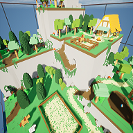

# wot_a_good_game
WOT: A Good Game - Wotxels; the first of its name

Youtube: https://www.youtube.com/@wellknowngamestudio9054
Twitter: https://twitter.com/WellKnownGames

## Overview

## Development

### Programming

Here's a useful [Unreal Engine Style
Guide](https://github.com/Allar/ue5-style-guide) that can help answer some
questions about why and how to do certain things within UE5.

### Modeling Workflow

All modeling is done with `VoxelMax`, make sure in the settings to select
`Optimize Mesh` and to configure the `Minimum Texture Size` to at least
1024x1024.

If you have exported from `VoxelMax` and get multiple materials in blender, then
you can fix that by baking those materials into a single texture following [this
guide](https://blender.stackexchange.com/questions/218406/how-to-bake-multiple-materials-on-a-single-texture)
or [this
guide](https://gamefromscratch.com/baking-blender-materials-to-texture-to-make-them-usable-in-a-game-engine/)

> :warning: NOTE: you need to be in the object edit mode when you export assets
> from VoxelMax, otherwise the origin / pivot point of the mesh will not be the
> local origin of the model, but will instead be the origin of the scene and
> you'll have to import with tralsation, rotation as well as scale.

#### Land and other Voxel / Destructable Assets

1. Model the land / object in `VoxelMax`
2. Export as `VOX`
3. Import into UE5
4. Create `VoxelWorld` object and set the voxel size to be 20 cm

#### Characters, NPCs, and Assets Requiring Rigging

1. Model the character(s) in `VoxelMax`
2. Export as `GLTF`
3. Scale the object to `0.25`
4. Import into `Blender` to rig - see the
   [./blender/README.md](./blender/README.md) for further instructions on
   rigging and export as FBX into UE5.
5. After importing, make sure to enable `CPU Access` in the skeletal mesh's settings in UE
   
#### Props, Foliage, and Non-Rigged Static Mesh Assets

1. Model the object in `VoxelMax`
2. Export as `FBX`
3. Import into UE5, with import scale to be `25`
4. You will likely have to import with a translation as well to get the pivot to
   be in the correct place on the object.
